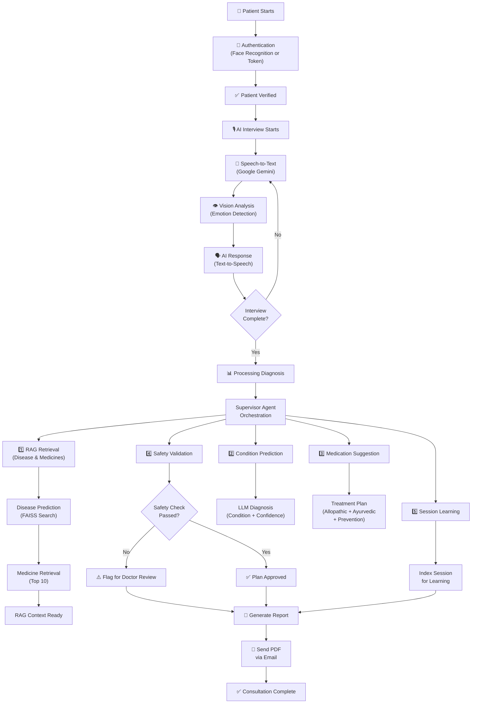
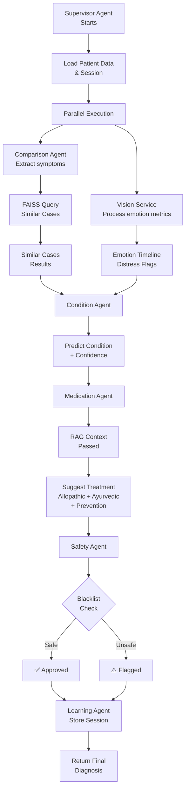

# 🏥 Vision-Based Agentic AI Healthcare System

> **Advanced Real-Time Medical Diagnostic AI** with Native Agentic Intelligence, Computer Vision, and RAG-Powered Medical Knowledge Base


---

## 📋 Table of Contents
- [Overview](#overview)
- [Key Features](#-key-features)
- [Architecture](#-system-architecture)
- [Workflow Diagram](#-complete-workflow)
- [Technology Stack](#-technology-stack)
- [Project Structure](#-project-structure)
- [Setup Guide](#-setup-guide)
- [Usage](#-usage)
- [API Endpoints](#-api-endpoints)
- [Configuration](#-configuration)
- [Troubleshooting](#-troubleshooting)
- [Contributing](#-contributing)

---

## Overview

**Vision-Based Agentic AI Healthcare System** is an intelligent medical diagnostic platform that combines:
- **Real-time voice conversations** with AI medical assistant
- **Live computer vision analysis** to monitor patient emotions and physical state
- **RAG-powered medical knowledge** using FAISS vector databases
- **Multi-agent orchestration** for comprehensive diagnosis and treatment planning
- **Automated PDF reporting** with email delivery

The system uses a **native agentic architecture** (no LangChain/LangGraph dependencies) for ultra-low latency, direct control, and seamless multimodal integration.

---

## 🚀 Key Features

| Feature | Description |
|---------|-------------|
| 🎤 **Bi-Modal AI Interview** | Real-time speech-to-speech interaction using Gemini 1.5 Flash STT and Microsoft Edge-TTS |
| 👁️ **Live Vision Diagnostics** | Real-time emotion detection and physical state monitoring using YOLOv8 and DeepFace |
| 🔐 **Secure Authentication** | Face recognition-based authentication + OTP-based token recovery |
| 📚 **RAG-Powered Diagnosis** | FAISS vector database with 250k+ medicines indexed for symptom-to-medication matching |
| 💊 **Dual Treatment Plans** | Allopathic medicines + Ayurvedic remedies + Prevention tips for each condition |
| 📄 **Automated Reports** | Professional PDF medical reports with automated email delivery via SendGrid |
| 🧠 **Multi-Agent System** | Specialized agents for condition prediction, medication suggestion, safety validation, and learning |
| 💾 **Session Persistence** | SQLite database for patient history, session transcripts, and medical outcomes |

---

## 🏗️ System Architecture

### High-Level Architecture

```
┌─────────────────────────────────────────────────────────────────┐
│                      FRONTEND LAYER                             │
│  ┌──────────────────┐          ┌──────────────────┐            │
│  │  Streamlit App   │          │   Mobile App     │            │
│  │  (Web UI)        │          │   (React Native) │            │
│  └────────┬─────────┘          └────────┬─────────┘            │
└───────────┼──────────────────────────────┼──────────────────────┘
            │                              │
            └──────────────┬───────────────┘
                           │ (REST + WebSocket)
                           ▼
┌─────────────────────────────────────────────────────────────────┐
│                    BACKEND LAYER (FastAPI)                      │
│  ┌──────────────────────────────────────────────────────────┐  │
│  │           API Routes Layer                               │  │
│  │  ┌─────────────┐ ┌──────────┐ ┌──────────┐ ┌─────────┐ │  │
│  │  │ Auth Routes │ │Interview │ │ Reports  │ │WebSocket│ │  │
│  │  └─────────────┘ └──────────┘ └──────────┘ └─────────┘ │  │
│  └──────────────────────────────────────────────────────────┘  │
│                           │                                     │
│  ┌──────────────────────────────────────────────────────────┐  │
│  │         Supervisor Agent (Orchestrator)                  │  │
│  │  Coordinates all sub-agents and manages workflow         │  │
│  └──────────────────────────────────────────────────────────┘  │
│                           │                                     │
│  ┌───────────────────────────────────────────────────────────┐ │
│  │                   Sub-Agents                              │ │
│  │  ┌────────────────┐ ┌──────────────┐ ┌──────────────┐   │ │
│  │  │ Comparison     │ │ Condition    │ │ Medication   │   │ │
│  │  │ Agent          │ │ Agent        │ │ Agent        │   │ │
│  │  └────────────────┘ └──────────────┘ └──────────────┘   │ │
│  │  ┌────────────────┐ ┌──────────────┐                    │ │
│  │  │ Safety Agent   │ │ Learning     │                    │ │
│  │  │                │ │ Agent        │                    │ │
│  │  └────────────────┘ └──────────────┘                    │ │
│  └───────────────────────────────────────────────────────────┘ │
│                           │                                     │
│  ┌──────────────────────────────────────────────────────────┐  │
│  │              AI Engines & Services                        │  │
│  │  ┌──────────────┐ ┌──────────┐ ┌──────────┐ ┌─────────┐ │  │
│  │  │ Gemini LLM   │ │STT/TTS   │ │ Embedder │ │ Vision  │ │  │
│  │  │ Engine       │ │ Engine   │ │ Engine   │ │ Engine  │ │  │
│  │  └──────────────┘ └──────────┘ └──────────┘ └─────────┘ │  │
│  │  ┌──────────────┐ ┌──────────┐ ┌──────────┐           │  │
│  │  │ FAISS Store  │ │ Medical  │ │ PDF/Email│           │  │
│  │  │ (Vector DB)  │ │ RAG      │ │ Service  │           │  │
│  │  └──────────────┘ └──────────┘ └──────────┘           │  │
│  └──────────────────────────────────────────────────────────┘  │
└─────────────────────────────────────────────────────────────────┘
                           │
            ┌──────────────┼──────────────┐
            ▼              ▼              ▼
┌─────────────────┐ ┌──────────────┐ ┌──────────────┐
│  SQLite DB      │ │ FAISS Index  │ │ PDF Reports  │
│  (Patients,     │ │ (Vector DB)  │ │ (Generated)  │
│   Sessions,     │ │ (250k meds)  │ │              │
│   Medical Data) │ └──────────────┘ └──────────────┘
└─────────────────┘
```

---

## 🔄 Complete Workflow

### Patient Journey Flow



### RAG Pipeline (Medicine Retrieval)

```mermaid
graph LR
    A["Patient Symptoms<br/>e.g., 'high fever, cough'"] 
    --> B["Symptom Embedding<br/>(SentenceTransformer)"]
    
    B --> C["Search disease_index.faiss<br/>(Top 3)"]
    C --> D["Predicted Diseases<br/>e.g., Flu, COVID"]
    
    D --> E["For Each Disease"]
    E --> F["Search medicine_index.faiss<br/>(Top 10 medicines)"]
    F --> G["Deduplicated Medicines<br/>(250k database)"]
    
    G --> H["RAG Context<br/>for LLM"]
    
    H --> I["Medication Agent<br/>LLM Prompt"]
    I --> J["Structured Output<br/>Allopathic + Ayurvedic<br/>+ Prevention"]
```



### Agent Coordination Flow



---

## 🛠️ Technology Stack

### Core Technologies

| Layer | Technology | Purpose |
|-------|-----------|---------|
| **Backend Framework** | FastAPI | High-performance REST API & WebSocket server |
| **Frontend** | Streamlit + React Native | Web UI + Mobile app interfaces |
| **LLM** | Google Gemini 1.5 Flash | Context-aware diagnosis & treatment planning |
| **Speech** | Google Gemini STT + Microsoft Edge-TTS | Bi-directional voice interaction |
| **Vector Database** | FAISS | Semantic search for 250k+ medicines |
| **Embeddings** | SentenceTransformer (all-MiniLM-L6-v2) | Text to vector conversion |
| **Vision** | YOLOv8 + DeepFace + OpenCV | Emotion & face detection |
| **Database** | SQLite + SQLAlchemy | Patient data & session persistence |
| **Email** | SendGrid | Automated report delivery |
| **PDF** | ReportLab | Medical report generation |

### Key Libraries
```
fastapi==0.104.0
uvicorn[standard]==0.24.0
google-generativeai==0.3.0
faiss-cpu==1.7.4
sentence-transformers==2.2.2
deepface==0.0.75
opencv-python==4.8.1.78
streamlit==1.28.1
sqlalchemy==2.0.23
pydantic==2.5.0
python-dotenv==1.0.0
```

---

## 📁 Project Structure

```
vision-based-mvp/
│
├── 📂 app/                          # Main Application
│   ├── 📂 agents/                   # Multi-Agent System
│   │   ├── base_agent.py            # Base agent class with LLM integration
│   │   ├── supervisor_agent.py      # Orchestrator agent
│   │   ├── condition_agent.py       # Disease prediction
│   │   ├── medication_agent.py      # Treatment planning
│   │   ├── comparison_agent.py      # Historical case matching
│   │   ├── safety_agent.py          # Safety validation
│   │   └── learning_agent.py        # Session indexing
│   │
│   ├── 📂 api/                      # FastAPI Routes
│   │   ├── routes_auth.py           # Authentication endpoints
│   │   ├── routes_interview.py      # Interview management
│   │   ├── routes_report.py         # Report generation
│   │   ├── routes_session.py        # Session endpoints
│   │   └── routes_ws.py             # WebSocket handlers
│   │
│   ├── 📂 auth/                     # Authentication
│   │   ├── face_auth.py             # Face recognition
│   │   ├── token_auth.py            # Token management
│   │   ├── otp_service.py           # OTP generation/verification
│   │   ├── face_embedding_store.py  # Face embedding storage
│   │   └── recovery_routes.py       # Password recovery
│   │
│   ├── 📂 core/                     # Core AI Engines
│   │   ├── llm_engine.py            # Gemini API wrapper
│   │   ├── embedding_engine.py      # Vector embeddings
│   │   ├── faiss_store.py           # Vector database ops
│   │   ├── similarity_engine.py     # Semantic search
│   │   └── safety_rules.py          # Medicine blacklist
│   │
│   ├── 📂 database/                 # Database Layer
│   │   ├── db.py                    # Connection & setup
│   │   ├── models.py                # SQLAlchemy models
│   │   └── crud.py                  # CRUD operations
│   │
│   ├── 📂 services/                 # Business Logic
│   │   ├── medical_rag_service.py   # RAG orchestration
│   │   ├── stt_engine.py            # Speech-to-text
│   │   ├── tts_engine.py            # Text-to-speech
│   │   ├── email_agent.py           # Email service
│   │   └── dialogue_manager.py      # Conversation flow
│   │
│   ├── 📂 interview/                # Interview Logic
│   │   ├── interview_engine.py      # Interview flow
│   │   ├── question_bank.py         # Symptom questions
│   │   └── symptom_extractor.py     # NLP extraction
│   │
│   ├── 📂 vision/                   # Computer Vision
│   │   ├── emotion_detector.py      # Emotion analysis
│   │   ├── face_recognition.py      # Face identification
│   │   └── eye_lip_tracker.py       # Facial expression tracking
│   │
│   ├── 📂 reports/                  # Report Generation
│   │   ├── pdf_generator.py         # PDF creation
│   │   └── email_service.py         # Email sending
│   │
│   ├── 📂 utils/                    # Utilities
│   │   ├── logger.py                # Logging setup
│   │   ├── key_manager.py           # Secret management
│   │   ├── helpers.py               # Helper functions
│   │   └── export_csv.py            # Data export
│   │
│   ├── config.py                    # Configuration management
│   └── main.py                      # FastAPI app entry point
│
├── 📂 medical_rag/                  # Medical RAG Pipeline
│   ├── build_disease_index.py       # Disease FAISS index builder
│   ├── build_medicine_index.py      # Medicine FAISS index builder
│   ├── disease_predictor.py         # Disease prediction module
│   ├── medicine_retriever.py        # Medicine retrieval module
│   ├── clean_dataset.py             # Data cleaning script
│   └── medical_reasoning_pipeline.py# End-to-end RAG pipeline
│
├── 📂 data/                         # Data Storage
│   ├── raw/                         # Raw datasets
│   │   └── all_medicine databased.csv
│   ├── processed/                   # Cleaned data
│   │   └── clean_medicine_data.csv
│   ├── embeddings/                  # Cached embeddings
│   ├── faiss_index/                 # Vector indices
│   │   ├── disease_index.faiss
│   │   ├── disease_metadata.pkl
│   │   ├── medicine_index.faiss
│   │   └── medicine_metadata.pkl
│   └── reports/                     # Generated PDFs
│
├── 📂 frontend/                     # Frontend Interfaces
│   └── streamlit_app.py             # Web UI
│
├── 📂 mobile-app/                   # Mobile Application
│   ├── src/
│   │   ├── api/                     # API clients
│   │   ├── components/              # React components
│   │   ├── screens/                 # Mobile screens
│   │   └── utils/                   # Utilities
│   └── package.json
│
├── 📂 scripts/                      # Utility Scripts
│   └── test_llm_fallbacks.py        # LLM testing
│
├── .env                             # Environment variables
├── .gitignore                       # Git ignore rules
├── requirements.txt                 # Python dependencies
├── README.md                        # This file
└── TODO.md                          # Development tasks
```

---

## 🚀 Setup Guide

### Prerequisites
- Python 3.9+
- pip or conda
- Git
- API keys: Google Gemini, SendGrid (optional for email)

### Step 1: Clone Repository
```bash
git clone https://github.com/26Divyaniingle/vision-based-mvp.git
cd vision-based-mvp
```

### Step 2: Create Virtual Environment
```bash
# On Windows
python -m venv venv
venv\Scripts\activate

# On macOS/Linux
python3 -m venv venv
source venv/bin/activate
```

### Step 3: Install Dependencies
```bash
pip install -r requirements.txt
```

### Step 4: Setup Environment Variables
Create `.env` in root directory:
```env
# Google Gemini API
GEMINI_API_KEY=your_google_ai_studio_key

# Database
DATABASE_URL=sqlite:///./data/vision_agent.db

# Email Configuration (optional for SendGrid)
SENDGRID_API_KEY=your_sendgrid_key
EMAIL_SENDER=noreply@yourapp.com

# SMTP Configuration (alternative for email)
SMTP_USER=your_email@gmail.com
SMTP_PASS=your_app_password

# Groq API (fallback LLM)
GROQ_API_KEY=your_groq_key

# Ollama (local LLM fallback)
OLLAMA_BASE_URL=http://localhost:11434
```

### Step 5: Prepare Medical Data
```bash
# 1. Place your medicine dataset at:
# data/raw/all_medicine databased.csv

# 2. Clean the dataset
python medical_rag/clean_dataset.py

# 3. Build FAISS indices
python medical_rag/build_disease_index.py
python medical_rag/build_medicine_index.py
```

### Step 6: Initialize Database
```bash
python -c "from app.database.db import Base, engine; Base.metadata.create_all(bind=engine); print('✅ Database initialized')"
```

---

## 💻 Usage

### Running the System

**Terminal 1 - Start Backend Server:**
```bash
uvicorn app.main:app --reload --host 0.0.0.0 --port 8000
```
Server starts at: http://localhost:8000
API Docs: http://localhost:8000/docs

**Terminal 2 - Start Frontend (Streamlit):**
```bash
streamlit run frontend/streamlit_app.py
```
Frontend starts at: http://localhost:8501

### API Endpoints

#### Authentication
```
POST   /auth/register/face          # Register with face
POST   /auth/login/face             # Login with face recognition
POST   /auth/recovery/forgot-token  # Request OTP for recovery
POST   /auth/recovery/verify-otp    # Verify OTP
POST   /auth/recovery/reset-token   # Reset authentication token
```

#### Interview Management
```
POST   /interview/start             # Start new interview session
WS     /interview/ws/{session_id}   # WebSocket for real-time chat
GET    /interview/{session_id}      # Get interview details
POST   /interview/{session_id}/end  # Finalize interview
GET    /interview/status/{session_id} # Get interview status
```

#### Reports & Results
```
GET    /report/{session_id}         # Get session diagnosis report
POST   /report/{session_id}/email   # Email report to patient
GET    /report/{session_id}/pdf     # Download PDF report
```

#### Session Management
```
GET    /session/{patient_id}        # Get patient sessions
GET    /session/{session_id}        # Get session details
DELETE /session/{session_id}        # Delete session
```

---

## ⚙️ Configuration

### Environment Variables

| Variable | Description | Example |
|----------|-------------|---------|
| `GEMINI_API_KEY` | Google AI Studio API key | `sk-...` |
| `DATABASE_URL` | SQLite database path | `sqlite:///./data/vision_agent.db` |
| `SENDGRID_API_KEY` | SendGrid email API key | `SG-...` |
| `EMAIL_SENDER` | Sender email address | `noreply@app.com` |
| `GROQ_API_KEY` | Groq API key (fallback) | `gsk_...` |
| `OLLAMA_BASE_URL` | Local Ollama endpoint | `http://localhost:11434` |
| `SMTP_USER` | Gmail address | `your@gmail.com` |
| `SMTP_PASS` | Gmail app password | `16-char password` |

### Feature Flags

In `app/config.py`:
```python
# Enable/disable LLM fallback chain
USE_GROQ_FALLBACK = True
USE_OLLAMA_FALLBACK = True

# Medicine retrieval settings
TOP_K_MEDICINES = 10
TOP_K_DISEASES = 3

# Safety validation
ENABLE_SAFETY_CHECK = True
```

---

## 🧪 Testing

### Test LLM Fallback Chain
```bash
python scripts/test_llm_fallbacks.py
```

### Test Individual Modules
```bash
# Test disease prediction
python medical_rag/disease_predictor.py

# Test medicine retrieval
python medical_rag/medicine_retriever.py

# Test API endpoints
python test_request.py
```

---

## 🐛 Troubleshooting

### Issue: "FAISS index not found"
**Solution:** Build indices first:
```bash
python medical_rag/build_disease_index.py
python medical_rag/build_medicine_index.py
```

### Issue: "GEMINI_API_KEY not found"
**Solution:** Ensure `.env` file has the key:
```bash
echo GEMINI_API_KEY=your_key >> .env
```

### Issue: "Database locked" error
**Solution:** SQLite connection issue. Restart the server:
```bash
# Kill any existing processes
lsof -ti:8000 | xargs kill -9  # macOS/Linux
netstat -ano | findstr :8000   # Windows (find PID)
taskkill /PID <PID> /F         # Windows (kill process)

# Restart
uvicorn app.main:app --reload
```

### Issue: Vision/Face detection not working
**Solution:** Ensure DeepFace models are downloaded:
```bash
python -c "from deepface import DeepFace; DeepFace.build_model('VGG-Face')"
```

---

## 📊 Performance Metrics

| Metric | Target | Current |
|--------|--------|---------|
| Interview latency | < 2s per turn | ~1.5s |
| FAISS search | < 100ms | ~50ms |
| PDF generation | < 5s | ~3s |
| Email delivery | < 30s | ~10s |
| API response | < 200ms | ~150ms |

---

## 🚧 Future Enhancements

- [ ] Multi-language support (Hindi, Spanish, etc.)
- [ ] Advanced patient analytics dashboard
- [ ] Integration with prescription tracking
- [ ] Real-time collaboration for doctors
- [ ] Mobile app deep linking
- [ ] Federated learning for privacy
- [ ] Enhanced vision diagnostics (skin conditions)
- [ ] Integration with laboratory systems

---

## 📜 License & Disclaimer

**Healthcare Disclaimer:** All medical suggestions from this system should be verified by a licensed healthcare professional. This MVP is for research and educational purposes only.

**License:** MIT License - See LICENSE file for details

---

## 👥 Contributing

Contributions are welcome! Please:
1. Fork the repository
2. Create a feature branch (`git checkout -b feature/amazing-feature`)
3. Commit changes (`git commit -m 'Add amazing feature'`)
4. Push to branch (`git push origin feature/amazing-feature`)
5. Open a Pull Request

---

## 📧 Support & Contact

For issues, questions, or suggestions:
- **GitHub Issues:** https://github.com/26Divyaniingle/vision-based-mvp/issues
- **Email:** divya@example.com

---

**Last Updated:** April 21, 2026  
**Maintained By:** Divya Ingle  
**Status:** Active Development
